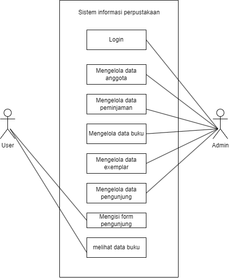
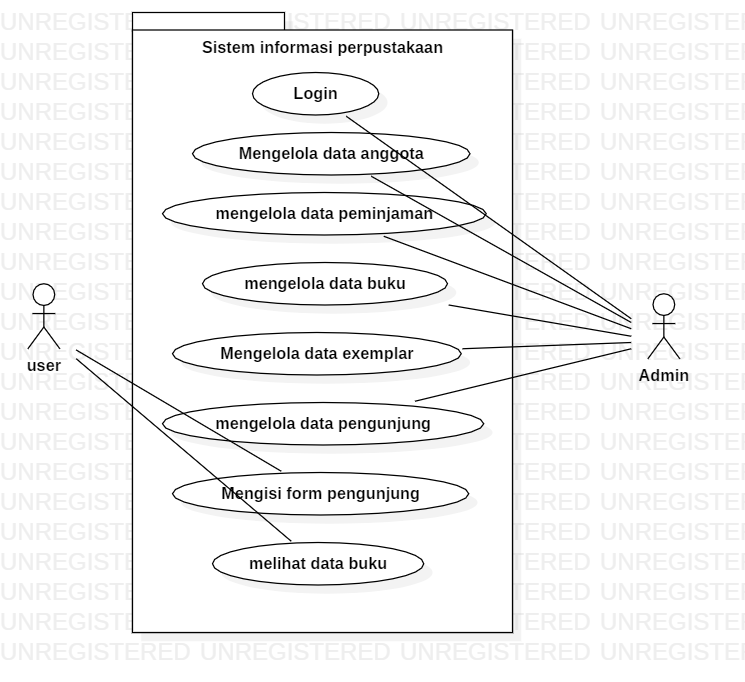
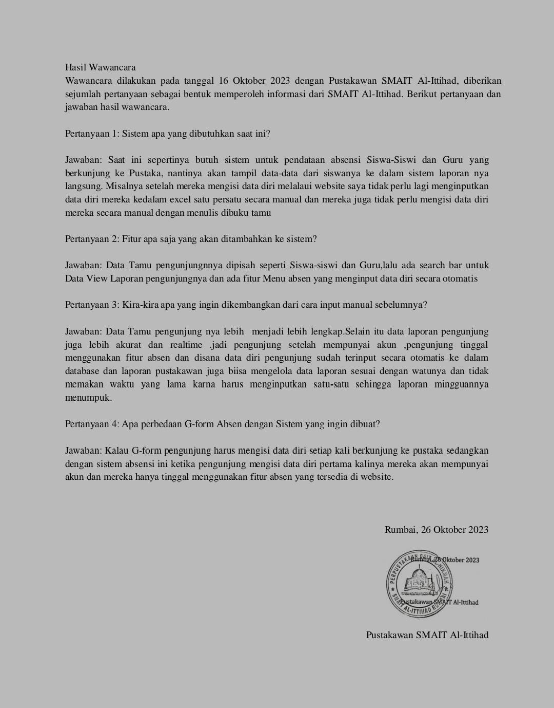

**BAB I Pendahuluan**
----------
1.1 Tujuan
----------
Dokumen Software Requirement Specification (SRS) merupakan dokumen spesifikasi perangkat lunak untuk membangun "Sistem Informasi Perpustakaan SMA AL-Ittihad Rumbai". Dokumen ini dibangun untuk memudahkan Perpustakaan SMA Al-Ittihad untuk pengelolaan Informasi terkait di perpustakaan sekolah tersebut. Sehingga dokumen ini dapat dijadikan acuan teknis untuk membangun "Sistem Informasi Perpustakaan SMA AL-Ittihad Rumbai Berbasis Website ".

1.2   Lingkup
----------
Sistem Informasi perpustakaan SMA Al-Ittihad Rumbai merupakan aplikasi berbasis website yang kami bangun untuk mempermudah staf perpustakaan dalam mengelola absensi dan meningkatkan efesiensi dan efektifitas pengelolaan data buku yang ada di perpustakaan tersebut, serta memudahkan staff dalam penginputan data -data.

1.3    Akronim, Singkatan, Definisi
----------
| Istilah | Definisi |
| ------ | ------ |
| SRS |Software Requirement Specification|
| Login | Digunakan untuk mengakses aplikasi |
| Software Requirement Specification | perangkat lunak yang akan dibuat dan sebagai penyembatani komunikasi pembuat dengan pengguna |
| Use Case | situasi dimana sistem anda digunakan untuk memenuhi satu atau lebih kebutuhan pemakaian anda |

1.4   Referensi
----------
Referensi yang digunakan dalam pengembangan perangkat lunak ini adalah :
- http://hasantarmizi.blogspot.co.id/2017/04/pengertian-sublime-text.html
- IEEE. IEEE Std 830-1998 IEEE Recommended Practice for Software  Requirements Specifications. IEEE Computer Society, 1998. 1.5  Overview 
- https://www.mysch.id/blog/detail/112/aplikasi-perpustakaan-digital
- https://www.talenta.co/blog/contoh-absensi-online-gratis-dengan-google-forms-hingga-mobile-app/
- https://opac.lib.pcr.ac.id/index.php?p=show_detail&id

1.5   Overview
----------
Bab selanjutnya yaitu menjelaskan sistem yang di terapkan pada aplikasi. Menjelaskan gambaran umum dari aplikasi, sistem interface aplikasi dan alur sistemnya. Bab terakhir menjelaskan tentang setiap fungsi yang digunakan secara teknisnya. Pada bab 2 dan 3 merupakan deskripsi dari aplikasi yang akan diterapkan pada aplikasi yang dibuat.

**BAB II Gambaran Umum**
----------
Pada zaman era globalisasi perkembangan teknologi begitu sangat pesat, salah satunya ialah perkembangan teknologi di bidang software engineering dimana software engineering dapat digunakan dalam kehidupan sehari–hari. Seperti perpustakaan tidak bisa dipisahkan dari pembelajaran siswa dan siswi di SMA IT AL-Ittihad dalam mencari ilmu pengetahuan. Fasilitas yang disediakan perpustakaan sekolah ini, sangatlah bermanfaat bagi semua siswa dan siswi dalam studi kasus proyek kami ini menganalisis kebutuhan suatu sekolah di daerah Pekanbaru tepatnya di Rumbai Kecamatan Rumbai Pesisir. Kasus yang kami peroleh pembuatan laporan pengunjung dan pengelolaan data Absensi serta Buku di Perpustakaan Sekolah. Maka dari itu kami sebagai software engineering merancang sebuah sistem sesuai dengan kebutuhan Sekolah ini dengan menerapkan sistem Informasi pengelolaan data  berbasis website yang akan menggantikan sistem manual sebelumnya. 

Dalam pembuatan sistem tersebut menggunakan pemrograman PHP dengan Sublime Text 3 dan menggunakan XAMPP untuk membuat databasenya. Penggunaan sistem absensi perpustakaan berbasis website ini diharapkan dapat mempermudah pustakawan dalam melakukan pengelolaan data di Perputakaan. Software yang kami buat ini berbasis website dimana website (pengunjung) perpustakaan SMA IT AL-Ittihad Rumbai. Sistem yang kami buat di dalamnya terdapat form kunjungan,data buku , data kunjungan,data eksemplar,data anggota pustaka,data peminjaman dan pngembalian buku.

Berikut akan kami jelaskan sistem software kami, fungsi admin yaitu :
   - kelola data anggota
   - kelola data peminjaman buku
   - kelola data pengembalian buku
   - kelola data exemplar
   - kelola data pengunjung
   - view statistik kunjungan
   - view data top kunjungan
   - view data top peminjaman
   
   Berikut ini fungsi pengunjung :
   - input form pengunjung
   - view data buku

2.1   Perspektif Produk
----------
Sistem absensi Perpustakaan SMA AL-Ittihad Rumbai berbasis website adalah sebuah sistem administrasi data yang diaplikasikan pada website. Terdapat 2 jenis, yaitu admin (staf perpustakaan) dan pengunjung.pengunjung dapat menginput Form kunjungan dan admin staf perpustakaan dapat melihat dan mengelola data yang telah diinputkan oleh pengunjung.

**2.1.1 Antarmuka Sistem**

Sistem Informasi Perpustakaan SMA Al-Ittihad Rumbai berbasis website ini memiliki 2 user, yaitu siswa-siswi (pengunjung) dan admin (staf perpustakaan). Siswa-siswi (pengunjung) mempunyai fungsi yaitu menginput data kunjungan dan admin (staf perpustakaan) dapat melihat data yang telah diinputkan oleh pengunjung.

**2.1.2 Antarmuka Pengguna**

   - **Prototype**

|  |  |
|--|--|
|  Halaman ini adalah halaman awal yang dirancang khusus untuk memperkenalkan dan mengarahkan pengunjung ke sistem informasi perpustakaan yang lebih lengkap. |  Halaman ini adalah tempat di mana pengguna dapat membuat akun untuk mengakses layanan perpustakaan secara online. |
|  Halaman ini  adalah tempat di mana pengguna yang sudah memiliki akun dapat memasukkan informasi login untuk mengakses layanan perpustakaan secara online. |  Halaman ini adalah halaman pribadi yang diberikan kepada pengguna setelah mereka berhasil login. |
|  Halaman ini adalah bagian yang memberikan akses kepada pengguna untuk menjelajahi dan mencari koleksi buku yang tersedia dalam perpustakaan. |  Halaman ini adalah fitur yang memungkinkan pengunjung untuk mencatat atau mendaftarkan kehadiran saat mengunjungi perpustakaan. |
|  Halaman ini adalah fitur yang memungkinkan pengunjung untuk mengelola proses peminjaman buku. |  Halaman ini adalah fitur yang memungkinkan pengunjung untuk mengelola proses pengembalian buku yang di pinjam. |
|  Halaman ini  adalah bagian yang memungkinkan admin untuk mengelola informasi pengunjung. |  Halaman ini adalah fitur yang memungkinkan admin untuk mengakses berbagai laporan dan data terkait aktivitas perpustakaan. |

   - **Website**

|  |  |
|--|--|
|  Halaman ini adalah halaman awal yang dirancang khusus untuk memperkenalkan dan mengarahkan pengunjung ke sistem informasi perpustakaan yang lebih lengkap. |  Halaman ini adalah tempat di mana pengguna dapat membuat akun untuk mengakses layanan perpustakaan secara online. |
|  Halaman ini  adalah tempat di mana pengguna yang sudah memiliki akun dapat memasukkan informasi login untuk mengakses layanan perpustakaan secara online. |  Halaman ini adalah halaman pribadi yang diberikan kepada pengguna setelah mereka berhasil login. |
|  Halaman ini adalah bagian yang memberikan akses kepada pengguna untuk menjelajahi dan mencari koleksi buku yang tersedia dalam perpustakaan. |  Halaman ini adalah fitur yang memungkinkan pengunjung untuk mencatat atau mendaftarkan kehadiran saat mengunjungi perpustakaan. |
|  Halaman ini adalah fitur yang memungkinkan pengunjung untuk mengelola proses peminjaman buku. |  Halaman ini adalah fitur yang memungkinkan pengunjung untuk mengelola proses pengembalian buku yang di pinjam. |
|  Halaman ini  adalah bagian yang memungkinkan admin untuk mengelola informasi pengunjung. |  Halaman ini adalah fitur yang memungkinkan admin untuk mengakses berbagai laporan dan data terkait aktivitas perpustakaan. |

**2.1.3 Antarmuka Perangkat Keras**

Antarmuka perangkat keras yang digunakan untuk mengoperasikan perangkat lunak sistem absensi perpustakaan SMA Al-Ittihad Rumbai antara lain :

1. PC / Laptop
Untuk menjalankan Aplikasi ini admin membutuhkan sebuah PC yang menggunakan OS Windows, Linux, atau MAC dan sudah terinstall browser .

**2.1.4 Operasi-Operasi**

| Operasi | Fungsi |
| ------ | ------ |
| Login | Digunakan untuk mengakses aplikasi |
| Input Data | Digunakan untuk memasukkan data-data |
| Kembali | Digunakan untuk kembali ke halaman sebelumnya |
| Hapus | Digunakan untuk menghapus data |
| Edit | Digunakan untuk mengubah data |
| View | Digunakan untuk menampilkan data |
| Simpan | Digunakan untuk menyimpan data |

2.2 Spesifikasi Kebutuhan Fungsional
----------

**2.2.1 Admin Login**

Use Case: Login

Diagram: 

Deskripsi Singkat:
Admin melakukan login menggunakan username dan password yang telah didaftarkan.
Deskripsi langkah-langkah:
1. Admin melakukan login dengan username dan password
2. Sistem melakukan validasi akun
3. Jika akun valid, maka sistem akan mengarahkan ke halaman dashboard
4. Jika akun tidak valid, maka admin diminta kembali menginputkan username dan password

**2.2.2 Admin Mengelola Data Anggota**

Use Case: Mengelola Data Anggota

Diagram :

Deskripsi Singkat:
Admin dapat mengelola data anggota, seperti tambah, edit, dan hapus.
Deskripsi langkah-langkah:
1. Admin memilih data anggota
2. Sistem menampilkan seluruh data anggota
3. Admin mengelola data anggota dan mengklik tombol simpan
4. Sistem menyimpan hasil kelola data anggota
      
**2.2.3 Admin Mengelola Data Peminjaman**

Use Case: Mengelola data Peminjaman

Diagram:
     

Deskripsi Singkat
Admin dapat mengelola data peminjaman, seperti tambah, edit, dan hapus.
Deskripsi langkah-langkah:
1. Admin memilih menu peminjaman
2. Sistem menampilkan seluruh data peminjaman
3. Admin mengelola data peminjaman dan mengklik tombol simpan
4. Sistem menyimpan hasil kelola data peminjaman

**2.2.4 Admin Kelola Data Buku**

Use Case: Mengelola Data Buku

Diagram:
  

Deskripsi Singkat:
Admin dapat mengelola data buku, seperti tambah, edit, dan hapus.
Deskripsi langkah-langkah:
1. Admin memilih menu buku
2. Sistem menampilkan seluruh data buku
3. Admin mengelola data buku dan mengklik tombol simpan
4. Sistem menyimpan hasil kelola data buku

**2.2.5 Admin Kelola Data Exemplar**

Use Case: Mengelola Data Exemplar

Diagram:
  

Deskripsi Singkat:
Admin dapat mengelola data exemplar, seperti tambah, edit, dan hapus.
Deskripsi langkah-langkah:
1. Admin memilih menu exemplar
2. Sistem menampilkan seluruh data exemplar
3. Admin mengelola data exemplar dan mengklik tombol simpan
4. Sistem menyimpan hasil kelola data exemplar

**2.2.6 Admin Kelola Data Pengunjung**

Use Case: Mengelola Data Pengunjung

Diagram:
  

Deskripsi Singkat:
Admin dapat mengelola data pengunjung, seperti tambah, edit, dan hapus.
Deskripsi langkah-langkah:
1. Admin memilih menu pengunjung
2. Sistem menampilkan seluruh data pengunjung
3. Admin mengelola data pengunjung dan mengklik tombol simpan
4. Sistem menyimpan hasil kelola data pengunjung

**2.2.7 Pengunjung Mengisi Form Pengunjung**

Use Case: Mengisi Form Pengunjung

Diagram:
 

Deskripsi Singkat:
User mengisi form pengunjung ketika datang ke perpustakaan.
Deskripsi langkah-langkah:
1. User memilih menu pengunjung
2. Sistem menampilkan form pengunjung
3. User mengisi form pengunjung dan menyimpan form
4. Sistem akan menyimpan inputan ke database dan inputan akan tampil pada menu pengunjung admin

**2.2.8 User Melihat Data Buku**

Use Case: Melihat Data Buku

Diagram:
 

Deskripsi Singkat:
User dapat melihat data buku.
Deskripsi langkah-langkah:
1. User memilih menu buku
2. User melakukan pencarian dengan memasukkan judul buku, kategori buku, nama pengarang, nama penerbit atau lokasi buku
3. Sistem menampilkan seluruh data yang diminta user
4. User melihat data yang diminta

2.3   Spesifikasi Kebutuhan Non-Fungsional
----------
- Tabel Kebutuhan Non-Fungsional 

   | No | Deskripsi |
   | ------ | ------ |
   | 1 | Semua interface dan fungsi menggunakan Bahasa Indonesia |
   | 2 | Perangkat Lunak dapat dipakai di semua platofrm  OS ( Admin dan pengunjung ) 
 
2.4   Karakteristik Pengguna
----------
Karakteristik pengguna dari perangkat lunak ini adalah pengguna langsung berinteraksi dengan sistem tanpa harus dihubungkan dengan hak akses atau level autentikasi.

2.5   Batasan-Batasan
----------
- Perangkat lunak web hanya dijalankan di windows (10 dan 11). 
- Waktu pengembangan perangkat lunak yang singkat membuat adanya kemungkinan tidak semua fungsi yang ada dapat dilaksanakan.

BAB III Requirement Specification
----------
3.1 Persyaratan Antarmuka Eksternal
----------
Salah satu cara mengakses aplikasi ini yaitu dengan menggunakan sistem ini pada website, kemudian admin login menggunakan username dan password Setelah login, admin  diarahkan ke dasbor yang memberikan ringkasan aktivitas dan dapat mengelola serta melihat seluruh data lalu Pengunjung dapat mengakses halaman pencarian dan kunjungan tanpa login.      
3.2 Functional Requirement
----------
Logika Struktur terdapat pada bagian 3.3.1

**3.2.1 Admin Login**

|  |  |
|--|--|
| Nama Fungsi | Login |
| Xref | Bagian 2.2.1, Admin Login |
| Trigger | Membuka website sistem informasi perpustakaan |
| Precondition | Halaman login |
| Basic Path | 1. Admin melakukan login dengan username dan password   2. Sistem melakukan validasi akun   3. Jika akun valid, maka sistem akan mengarahkan ke halaman dashboard   4. Jika akun tidak valid, maka admin diminta kembali menginputkan username dan password |
| Alternative | Tidak ada |
| Post Condition | Admin berhasil login dan mengakses website |
| Exception Push | Username dan password salah |
   
**3.2.2 Admin Mengelola Data Anggota**

|  |  |
|--|--|
| Nama Fungsi | Mengelola Data Anggota |
| Xref | Bagian 2.2.2, Admin Mengelola Data Anggota |
| Trigger | Membuka website sistem informasi perpustakaan |
| Precondition | Halaman dashboard admin |
| Basic Path | 1. Admin memilih data anggota   2. Sistem menampilkan seluruh data anggota   3. Admin mengelola data anggota dan mengklik tombol simpan   4. Sistem menyimpan hasil kelola data anggota |
| Alternative | Tidak ada |
| Post Condition | Admin berhasil mengelola data anggota |
| Exception Push | Tidak ada koneksi |

**3.2.3 Admin Mengelola Data Peminjaman**

|  |  |
|--|--|
| Nama Fungsi | Mengelola Data Peminjaman |
| Xref | Bagian 2.2.3, Admin Mengelola Data Peminjaman |
| Trigger | Membuka website sistem informasi perpustakaan |
| Precondition | Halaman dashboard admin |
| Basic Path | 1. Admin memilih menu peminjaman   2. Sistem menampilkan seluruh data peminjaman   3. Admin mengelola data peminjaman dan mengklik tombol simpan   4. Sistem menyimpan hasil kelola data peminjaman |
| Alternative | Tidak ada |
| Post Condition | Admin berhasil mengelola data peminjaman |
| Exception Push | Tidak ada koneksi |

**3.2.4 Admin Mengelola Data Buku**

|  |  |
|--|--|
| Nama Fungsi | Mengelola Data Buku |
| Xref | Bagian 2.2.4, Admin Mengelola Data Buku |
| Trigger | Membuka website sistem informasi perpustakaan |
| Precondition | Halaman dashboard admin |
| Basic Path | 1. Admin memilih menu buku   2. Sistem menampilkan seluruh data buku   3. Admin mengelola data buku dan mengklik tombol simpan   4. Sistem menyimpan hasil kelola data buku |
| Alternative | Tidak ada |
| Post Condition | Admin berhasil mengelola data buku |
| Exception Push | Tidak ada koneksi |

**3.2.5 Admin Mengelola Data Exemplar**

|  |  |
|--|--|
| Nama Fungsi | Mengelola Data Exemplar |
| Xref | Bagian 2.2.5, Admin Mengelola Data Exemplar |
| Trigger | Membuka website sistem informasi perpustakaan |
| Precondition | Halaman dashboard admin |
| Basic Path | 1. Admin memilih menu exemplar   2. Sistem menampilkan seluruh data exemplar   3. Admin mengelola data exemplar dan mengklik tombol simpan   4. Sistem menyimpan hasil kelola data exemplar |
| Alternative | Tidak ada |
| Post Condition | Admin berhasil mengelola data exemplar |
| Exception Push | Tidak ada koneksi |

**3.2.6 Admin Mengelola Data Pengunjung**

|  |  |
|--|--|
| Nama Fungsi | Mengelola Data Pengunjung |
| Xref | Bagian 2.2.6, Admin Mengelola Data Pengunjung |
| Trigger | Membuka website sistem informasi perpustakaan |
| Precondition | Halaman dashboard admin |
| Basic Path | 1. Admin memilih menu pengunjung   2. Sistem menampilkan seluruh data pengunjung   3. Admin mengelola data pengunjung dan mengklik tombol simpan   4. Sistem menyimpan hasil kelola data pengunjung |
| Alternative | Tidak ada |
| Post Condition | Admin berhasil mengelola data pengunjung |
| Exception Push | Tidak ada koneksi |

**3.2.7 User Mengisi Form Pengunjung**

|  |  |
|--|--|
| Nama Fungsi | Mengisi Form Pengunjung |
| Xref | Bagian 2.2.7, User Mengisi Form Pengunjung |
| Trigger | Membuka website sistem informasi perpustakaan |
| Precondition | Halaman onboarding |
| Basic Path | 1. User memilih menu pengunjung   2. Sistem menampilkan form pengunjung   3. User mengisi form pengunjung dan menyimpan form   4. Sistem akan menyimpan inputan ke database dan inputan akan tampil pada menu pengunjung admin |
| Alternative | Tidak ada |
| Post Condition | Pengunjung berhasil mengisi data pengunjung |
| Exception Push | Tidak ada koneksi |

**3.2.8 User Melihat Data Buku**

|  |  |
|--|--|
| Nama Fungsi | Melihat Data Buku |
| Xref | Bagian 2.2.8, User Melihat Data Buku |
| Trigger | Membuka website sistem informasi perpustakaan |
| Precondition | Halaman onboarding |
| Basic Path | 1. User memilih menu buku   2. User melakukan pencarian dengan memasukkan judul buku, kategori buku, nama pengarang, nama penerbit atau lokasi buku   3. 3. Sistem menampilkan seluruh data yang diminta user   4. User melihat data yang diminta |
| Alternative | Tidak ada |
| Post Condition | User berhasil melihat data buku |
| Exception Push | Tidak ada koneksi |
   
3.3 Struktur Detail Kebutuhan Non-Fungsional
----------
**3.3.1 Logika Struktur Data**
Struktur data logika pada sistem informasi perpustakaan terdapat struktur database yang dijelaskan menggunakan ERD.

**Tabel Admin**

| Data Item | Type | Deskripsi |
| ------ | ------ | ------ |
| id | varchar | Nomor auto increment id admin |
| nama | varchar | Berisikan nama admin |
| jk | varchar | Berisikan jenis kelamin admin |
| role | varchar | Untuk membedakan role saat login |
| username | varchar | Berisikan NIP untuk akses login admin |
| password | varchar | Berisikan password untuk login admin |

**Tabel Anggota**

| Data Item | Type | Deskripsi |
| ------ | ------ | ------ |
| id | varchar | Nomor auto increment id anggota |
| kode_anggota | varchar | Berisikan kode anggota |
| jenis_anggota | varchar | Berisikan jenis anggota |
| nama | varchar | Berisikan nama admin |
| jenis_kelamin | varchar | Berisikan jenis kelamin anggota |

**Tabel Buku**

| Data Item | Type | Deskripsi |
| ------ | ------ | ------ |
| id | varchar | Nomor auto increment id buku |
| judul | varchar | Berisikan judul buku |
| pengarang | varchar | Berisikan pengarang buku |
| th_terbit | varchar | Berisikan tahun terbit buku |
| penerbit | varchar | Berisikan penerbit buku |
| isbn | varchar | Berisikan isbn buku |
| kategori | varchar | Berisikan kategori buku |
| lokasi | varchar | Berisikan lokasi buku |
| gambar | varchar | Berisikan gambar buku |

**Tabel Eksemplar**

| Data Item | Type | Deskripsi |
| ------ | ------ | ------ |
| id | varchar | Nomor auto increment id eksemplar |
| buku_id | varchar | Foreign key dari tabel buku |
| kode_eksemplar | varchar | Berisikan kode dari eksemplar |
| kesan_pesan | varchar | Berisikan kesan dan pesan |

**Tabel Peminjaman**

| Data Item | Type | Deskripsi |
| ------ | ------ | ------ |
| id | varchar | Nomor auto increment id peminjaman |
| anggota_id | varchar | Foreign key dari tabel anggota |
| eksemplar_id | varchar | Foreign key dari tabel eksemplar |
| tanggal_pinjam | date | Berisikan tanggal peminjaman |
| tanggal_kembali | date | Berisikan tanggal pengembalian |
| status | varchar | Berisikan status buku |

**Tabel Pengunjung**

| Data Item | Type | Deskripsi |
| ------ | ------ | ------ |
| id | varchar | Nomor auto increment id pengunjung |
| jenis_pengunjung | varchar | Berisikan jenis pengunjung |
| id_tamu | varchar | Nomor auto increment id tamu |
| nama | varchar | Berisikan nama pengunjung |
| asal | varchar | Berisikan asal pengunjung |
| tujuan | varchar | Berisikan tujuan kunjungan |
| tanggal_waktu | datetime | Berisikan tanggal dan waktu kunjungan |

Dokumentasi dan Validasi Wawancara
----------

Jobdesk
----------

| Nama | Jobdesk |
| ------ | ------ |
| Rina Al-Qomar Puji Siswati | Bab 1 dan bab 2 ,prototype|
| Said Fahrur Raziq | Bab 2 |
| Shasy Wiade Putri | Bab 2, bab 3, dan prototype |
