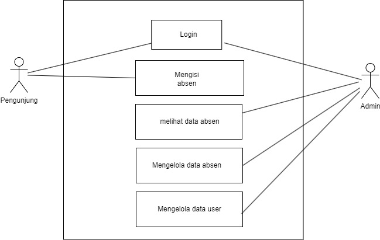

<html>
<body>

<h1> Software Requirements Spesification</h1>

<b>Version 1.7 </b> 

28 Maret 2018</b>

<b>Manajemen Administrasi Data Kependudukan Desa Lohbener  
</b>

Kelompok 1  
 Hilmy Lazuardi            (1603099) 
 Ismatul Maula    (1603100) 
 jakaria       (1603101)   

<b>Jurusan Teknik Informatika</b> 

<b>Politeknik Negeri Indramayu</b>

<b>2018</b>

</body>
</html>
 

**BAB I Pendahuluan**
----------
1.1 Tujuan
----------
Dokumen Software Requirement Specification (SRS) merupakan dokumen spesifikasi perangkat lunak untuk membangun "Sistem Absensi Perpustakaan SMA AL-Ittihad Rumbai". Dokumen ini dibangun untuk memudahkan Perpustakaan SMA Al-Ittihad untuk menginput absen di perpustakaan sekolah tersebut. Sehingga dokumen ini dapat dijadikan acuan teknis untuk membangun "Sistem Absensi Perpustakaan SMA AL-Ittihad Rumbai Berbasis Website ".

1.2   Lingkup
----------
Sistem absensi perpustakaan SMA Al-Ittihad Rumbai merupakan aplikasi berbasis website yang kami bangun untuk mempermudah staf perpustakaan dalam mengelola absensi yang ada di perpustakaan tersebut, serta memudahkan staf dalam melihat laporan karena sudah terhubung ke dalam database.

1.3    Akronim, singkatan, definisi
----------
| Istilah | Definisi |
| ------ | ------ |
| SRS |Software Requirement Specification|
| Login | Digunakan untuk mengakses aplikasi |
| Software Requirement Specification | perangkat lunak yang akan dibuat dan sebagai penyembatani komunikasi pembuat dengan pengguna |
| Use Case | situasi dimana sistem anda digunakan untuk memenuhi satu atau lebih kebutuhan pemakaian anda |

1.4   Referensi
----------
Referensi yang digunakan dalam pengembangan perangkat lunak ini adalah :
- http://hasantarmizi.blogspot.co.id/2017/04/pengertian-sublime-text.html
- IEEE. IEEE Std 830-1998 IEEE Recommended Practice for Software  Requirements Specifications. IEEE Computer Society, 1998. 1.5  Overview 
- https://www.mysch.id/blog/detail/112/aplikasi-perpustakaan-digital
- https://www.talenta.co/blog/contoh-absensi-online-gratis-dengan-google-forms-hingga-mobile-app/

1.5   Overview
----------
Bab selanjutnya yaitu menjelaskan sistem yang di terapkan pada aplikasi. Menjelaskan gambaran umum dari aplikasi, sistem interface aplikasi dan alur sistemnya. Bab terakhir menjelaskan tentang setiap fungsi yang digunakan secara teknisnya. Pada bab 2 dan 3 merupakan deskripsi dari aplikasi yang akan diterapkan pada aplikasi yang dibuat.

**BAB II Gambaran umum**
----------
Pada zaman era globalisasi perkembangan teknologi begitu sangat pesat, salah satunya ialah perkembangan teknologi di bidang software engineering dimana software engineering dapat digunakan dalam kehidupan sehari–hari. Seperti perpustakaan tidak bisa dipisahkan dari pembelajaran siswa dan siswi di SMA IT AL-Ittihad dalam mencari ilmu pengetahuan. Fasilitas yang disediakan perpustakaan sekolah ini, sangatlah bermanfaat bagi semua siswa dan siswi dalam studi kasus proyek kami ini menganalisis kebutuhan suatu sekolah di daerah Pekanbaru tepatnya di Rumbai Kecamatan Rumbai Pesisir. Kasus yang kami peroleh pembuatan laporan pengunjung di Perpustakaan Sekolah ini. Maka dari itu kami sebagai software engineering merancang sebuah sistem sesuai dengan kebutuhan Sekolah ini dengan menerapkan sistem absensi berbasis website yang akan menggantikan sistem manual sebelumnya. 

Dalam pembuatan sistem tersebut menggunakan pemrograman PHP dengan Sublime Text 3 dan menggunakan XAMPP untuk membuat databasenya. Penggunaan sistem absensi perpustakaan berbasis website ini diharapkan dapat mempermudah pustakawan dalam memperoleh data kehadiran siswa dan menginputkan data-data kunjungan siswa-siswi. Software yang kami buat ini berbasis website dimana website sebagai siswa-siswi (pengunjung) perpustakaan SMA IT AL-Ittihad Rumbai. Sistem yang kami buat di dalamnya terdapat data diri dan data kunjungan.

Berikut akan kami jelaskan sistem software kami, fungsi admin yaitu :
   - Input data diri
   - Kelola data diri
   - View data diri pengunjung
   - View data kunjungan
   - Kelola data kunjungan
   
   Berikut ini fungsi pengunjung :
   - Input data diri
   - Kelola data diri
   - Input data kunjungan

2.1   Perspektif produk
----------
Sistem absensi Perpustakaan SMA AL-Ittihad Rumbai berbasis website adalah sebuah sistem administrasi data yang diaplikasikan pada website. Terdapat 2 jenis, yaitu admin (staf perpustakaan) dan siswa-siswi (pengunjung). Siswa-siswi (pengunjung) dapat menginput data kunjungan dan admin (staf perpustakaan) dapat melihat data yang telah diinputkan oleh pengunjung.

**2.1.1 Antarmuka sistem**

Sistem Absensi Perpustakaan SMA Al-Ittihad Rumbai berbasis website ini memiliki 2 user, yaitu siswa-siswi (pengunjung) dan admin (staf perpustakaan). Siswa-siswi (pengunjung) mempunyai fungsi yaitu menginput data kunjungan dan admin (staf perpustakaan) dapat melihat data yang telah diinputkan oleh pengunjung.

**2.1.2 Antarmuka pengguna**

   - **Mockup Admin ( Website )**

|  |  |
|--|--|
|  Pada halaman login admin diminta untuk mengisi username dan password.|  Pada Dashboard admin terdapat panel-panel seperti penduduk, pendidikan, agama, pekerjaan, laporan dan ucapan selamat datang.|
|  Pada halaman dashboard ada navigation bar kependudukan yang berisi dropdown angka kelahiran dan angka kematian|  Pada Halaman agama dapat menginputkan data agama penduduk|
|  Pada Halaman pekerjaan dapat menginputkan data pekerjaan penduduk|  Pada Halaman warga dapat menginputkan data warga|
|  Pada Halaman pendidikan dapat menginputkan data pendidikan penduduk|  Pada Halaman kelahiran dapat menginputkan data kelahiran penduduk|
|  Pada Halaman kematian dapat menginputkan data kematian penduduk|  Pada Halaman grafik kelahiran dapat melihat data angka kelahiran|
|  Pada Halaman grafik kematian dapat melihat data angka kematian|  Pada Halaman laporan dapat melihat dan mendownload laporan penduduk|
|  Pada halaman lupa password dapat mengganti password terlebih dahulu memasukkan username dan password sebelumnya| |
 
**2.1.3 Antarmuka perangkat keras**

Antarmuka perangkat keras yang digunakan untuk mengoperasikan perangkat lunak sistem absensi perpustakaan SMA Al-Ittihad Rumbai antara lain :

1. PC / Laptop
Untuk menjalankan Aplikasi ini admin membutuhkan sebuah PC yang menggunakan OS Windows, Linux, atau MAC dan sudah terinstall browser .

**2.1.4 Operasi-operasi**

| Operasi | Fungsi |
| ------ | ------ |
| Login | Digunakan untuk mengakses aplikasi |
| Input Data | Digunakan untuk memasukkan data-data |
| Kembali | Digunakan untuk kembali ke halaman sebelumnya |
| Hapus | Digunakan untuk menghapus data |
| Edit | Digunakan untuk mengubah data |
| View | Digunakan untuk menampilkan data |
| Simpan | Digunakan untuk menyimpan data |

2.2 Spesifikasi Kebutuhan fungsional
----------

   
**2.2.1 Admin Registrasi**

Use Case: Registrasi

Diagram : 

Deskripsi Singkat:
Admin melakukan registrasi terlebih dahulu sebelum masuk ke tampilan login.
Deskripsi langkah-langkah:
1. Admin melakukan registrasi dengan mengisi form registrasi
2. Sistem melakukan validasi registrasi akun
3. Jika berhasil, sistem akan mengarahkan ke halaman login
4. Jika gagal, sistem akan menampilkan peringatan dan admin kembali diminta mengisi form registrasi
   
**2.2.2 Admin Login**

Use Case: Login

Diagram: 

Deskripsi Singkat:
Admin melakukan login menggunakan username dan password yang telah didaftarkan ketika registrasi.
Deskripsi Langkah-langkah:
1. Admin melakukan login dengan username dan password
2. Sistem melakukan validasi akun
3. Jika akun valid, maka sistem akan mengarahkan ke halaman dashboard
4. Jika akun tidak valid, maka admin diminta kembali menginputkan username dan password

**2.2.3 Admin Kelola Data User**

Use Case: Kelola Data User

Diagram :

Deskripsi Singkat:
Admin dapat mengelola data user, seperti tambah, edit, dan hapus.
Deskripsi Langkah-langkah:
1. Admin memilih data user
2. Sistem menampilkan seluruh data user
3. Admin mengelola data user dan mengklik tombol simpan
4. Sistem menyimpan hasil kelola data user
      
**2.2.4 Admin Lihat Data Absen**

Use Case: Lihat Data Absen

Diagram:

      
Deskripsi Singkat
Admin dapat melihat data absen yang telah di input oleh pengunjung.
Deskripsi Langkah-langkah
1. Admin memilih menu absen
2. Sistem menampilkan data absen
3. Admin melihat data absen

**2.2.5 Admin Kelola Data Absen**

Use Case: Kelola Data Absen

Diagram:

Deskripsi Singkat:
Admin dapat mengelola data absen, seperti tambah, edit, dan hapus.
Deskripsi Langkah-langkah:
1. Admin memilih menu absen
2. Sistem menampilkan seluruh data absen
3. Admin mengelola data absen dan mengklik tombol simpan
4. Sistem menyimpan hasil kelola data absen

**2.2.6 Pengunjung Registrasi**

Use Case: Registrasi

Diagram:

Deskripsi Singkat:
Pengunjung melakukan registrasi terlebih dahulu sebelum masuk ke tampilan login.
Deskripsi langkah-langkah:
1. Pengunjung melakukan registrasi dengan mengisi form registrasi
2. Sistem melakukan validasi registrasi akun
3. Jika berhasil, sistem akan mengarahkan ke halaman login
4. Jika gagal, sistem akan menampilkan peringatan dan pengunjung kembali diminta mengisi form registrasi 

**2.2.7 Pengunjung Login**

Use Case: Login

Diagram:

Deskripsi Singkat:
Pengunjung melakukan login menggunakan username dan password yang telah didaftarkan ketika registrasi.
Deskripsi Langkah-langkah:
1. Pengunjung melakukan login dengan username dan password
2. Sistem melakukan validasi akun
3. Jika akun valid, maka sistem akan mengarahkan ke halaman dashboard
4. Jika akun tidak valid, maka pengunjung diminta kembali menginputkan username dan password

**2.2.8 Pengunjung Mengisi Data Absen**

Use Case: Mengisi Data Absen

Diagram:

Deskripsi Singkat:
Pengunjung menginputkan data absen yang diminta oleh sistem.
Deskripsi Langkah-langkah:
1. Pengunjung membuka halaman absen
2. Sistem menampilkan form pada halaman absen
3. Pengunjung mengisi form absen
4. Sistem akan menyimpan inputan ke database dan inputan akan tampil pada halaman absen admin

2.3   Spesifikasi Kebutuhan non-fungsional
----------
- Tabel Kebutuhan Non-Fungsional 

   | No | Deskripsi |
   | ------ | ------ |
   | 1 | Semua interface dan fungsi menggunakan Bahasa Indonesia |
   | 2 | Perangkat Lunak dapat dipakai di semua platofrm  OS ( Admin, sekdes dan kepala desa ) 
 
2.4   Karakteristik pengguna
----------
Karakteristik pengguna dari perangkat lunak ini adalah pengguna langsung berinteraksi dengan sistem tanpa harus dihubungkan dengan hak akses atau level autentikasi.

2.5   Batasan-batasan
----------
- Perangkat lunak web hanya dijalankan di windows (10 dan 11). 
- Waktu pengembangan perangkat lunak yang singkat membuat adanya kemungkinan tidak semua fungsi yang ada dapat dilaksanakan.

BAB III Requirement specification
----------
3.1 Persyaratan Antarmuka Eksternal
----------
Salah satu cara mengakses aplikasi ini yaitu dengan registrasi akun, kemudian admin maupun pengunjung login menggunakan username dan password yang telah didaftarkan ketika registrasi. Setelah berhasil login, pengunjung dapat mengisi absen dan admin dapat melihat absen yang telah diinputkan oleh pengunjung dan mengelola data di sistem tersebut.
      
3.2 Functional Requirement
----------
Logika Struktur terdapat pada bagian 3.3.1
      
**3.2.1 Admin Registrasi**

|  |  |
|--|--|
| Nama Fungsi | Registrasi |
| Xref | Bagian 2.2.1, Admin Registrasi |
| Trigger | Membuka website sistem absensi perpustakaan |
| Precondition | Halaman registrasi |
| Basic Path | 1. Admin melakukan registrasi dengan mengisi form registrasi   2. Sistem melakukan validasi registrasi akun   3. Jika berhasil, sistem akan mengarahkan ke halaman login   4. Jika gagal, sistem akan menampilkan peringatan dan admin kembali diminta mengisi form registrasi |
| Alternative | Tidak ada |
| Post Condition | Admin berhasil validasi akun dan dapat melakukan login |
| Exception Push | Validasi akun gagal |
      
**3.2.2 Admin Login**

|  |  |
|--|--|
| Nama Fungsi | Login |
| Xref | Bagian 2.2.2, Admin Login |
| Trigger | Membuka website sistem absensi perpustakaan |
| Precondition | Halaman login |
| Basic Path | 1. Admin melakukan login dengan username dan password   2. Sistem melakukan validasi akun   3. Jika akun valid, maka sistem akan mengarahkan ke halaman dashboard   4. Jika akun tidak valid, maka admin diminta kembali menginputkan username dan password |
| Alternative | Tidak ada |
| Post Condition | Admin berhasil login dan mengakses website |
| Exception Push | Username dan password salah |
   
**3.2.3 Admin Kelola Data User**

|  |  |
|--|--|
| Nama Fungsi | Kelola Data User |
| Xref | Bagian 2.2.3, Admin Kelola Data User |
| Trigger | Membuka website sistem absensi perpustakaan |
| Precondition | Halaman dashboard admin |
| Basic Path | 1. Admin memilih data user   2. Sistem menampilkan seluruh data user   3. Admin mengelola data user dan mengklik tombol simpan   4. Sistem menyimpan hasil kelola data user |
| Alternative | Tidak ada |
| Post Condition | Admin berhasil mengelola data user |
| Exception Push | Tidak ada koneksi |
   
**3.2.4 Admin Lihat Data Absen**

|  |  |
|--|--|
| Nama Fungsi | Lihat Data Absen |
| Xref | Bagian 2.2.4, Admin Lihat Data Absen |
| Trigger | Membuka website sistem absensi perpustakaan |
| Precondition | Halaman dashboard admin |
| Basic Path | 1.  Admin memilih menu absen   2. Sistem menampilkan data absen   3. Admin melihat data absen |
| Alternative | Tidak ada |
| Post Condition | Admin dapat melihat data absen |
| Exception Push | Tidak ada koneksi |
   
**3.2.5 Admin Kelola Data Absen**

|  |  |
|--|--|
| Nama Fungsi | Kelola Data Absen |
| Xref | Bagian 2.2.5, View data kependudukan |
| Trigger |  Membuka website sistem absensi perpustakaan |
| Precondition | Halaman dashboard admin |
| Basic Path | 1. Admin memilih menu absen   2. Sistem menampilkan seluruh data absen   3. Admin mengelola data absen dan mengklik tombol simpan   4. Sistem menyimpan hasil kelola data absen |
| Alternative | Tidak ada |
| Post Condition | Admin berhasil mengelola data absen |
| Exception Push | Tidak ada koneksi |
   
**3.2.6 Pengunjung Registrasi**

|  |  |
|--|--|
| Nama Fungsi | Registrasi |
| Xref | Bagian 2.2.6, Pengunjung Registrasi |
| Trigger | Membuka website sistem absensi perpustakaan |
| Precondition | Halaman registrasi |
| Basic Path | 1. Pengunjung melakukan registrasi dengan mengisi form registrasi   2. Sistem melakukan validasi registrasi akun   3. Jika berhasil, sistem akan mengarahkan ke halaman login   4. Jika gagal, sistem akan menampilkan peringatan dan pengunjung kembali diminta mengisi form registrasi |
| Alternative | Tidak ada |
| Post Condition | Pengunjung berhasil validasi akun dan dapat melakukan login |
| Exception Push | Validasi akun gagal |

**3.2.7 Pengunjung Login**

|  |  |
|--|--|
| Nama Fungsi | Login |
| Xref | Bagian 2.2.7, Pengunjung Login |
| Trigger | Membuka website sistem absensi perpustakaan |
| Precondition | Halaman login |
| Basic Path | 1. Pengunjung melakukan login dengan username dan password   2. Sistem melakukan validasi akun   3. Jika akun valid, maka sistem akan mengarahkan ke halaman dashboard   4. Jika akun tidak valid, maka pengunjung diminta kembali menginputkan username dan password |
| Alternative | Tidak ada |
| Post Condition | Pengunjung berhasil login dan mengakses website |
| Exception Push | Username dan password salah |

**3.2.8 Pengunjung Mengisi Data Absen**

|  |  |
|--|--|
| Nama Fungsi | Input Absen |
| Xref | Bagian 2.2.8, Mengisi Data Absen |
| Trigger | Membuka website sistem absensi perpustakaan |
| Precondition | Halaman dahboard pengunjung |
| Basic Path | 1. Pengunjung membuka halaman absen   2. Sistem menampilkan form pada halaman absen   3. 3. Pengunjung mengisi form absen   4. Sistem akan menyimpan inputan ke database dan inputan akan tampil pada halaman absen admin |
| Alternative | Tidak ada |
| Post Condition | Pengunjung berhasil input absen |
| Exception Push | Tidak ada koneksi |
   
3.3 Struktur Detail Kebutuhan Non-Fungsional
----------
**3.3.1 Logika Struktur Data**
Struktur data logika pada sistem absensi perpustakaan terdapat struktur database yang dijelaskan menggunakan ERD.

**Tabel Siswa**

| Data Item | Type | Deskripsi |
| ------ | ------ | ------ |
| id_admin| varchar | Nomor auto increment id_admin |
| username | varchar | Berisikan NIP untuk akses login admin |
| password | varchar | Berisikan password untuk login admin |
| role | varchar | Untuk membedakan role saat login |
| nama | varchar | Berisikan nama admin |
| jenis_kelamin | varchar | Berisikan jenis kelamin admin |

**Tabel Pengunjung**

| Data Item | Type | Deskripsi |
| ------ | ------ | ------ |
| id_pengunjung| varchar | Nomor auto increment id_pengunjung |
| username | varchar | Berisikan NIP untuk akses login pengunjung |
| password | varchar | Berisikan password untuk login pengunjung |
| role | varchar | Untuk membedakan role saat login |
| nama | varchar | Berisikan nama pengunjung |
| asal | varchar | Berisikan asal pengunjung |
| jenis_kelamin | varchar | Berisikan jenis kelamin pengunjung |

**Tabel Absen**

| Data Item | Type | Deskripsi |
| ------ | ------ | ------ |
| id_absen| varchar | Nomor auto increment id_absen |
| username | varchar | Berisikan NISN/NIP untuk mengisi absen kunjungan |
| tanggal_waktu | datetime | Berisikan tanggal dan waktu kunjungan |
| tujuan | varchar | Berisikan tujuan kunjungan |
| kesan_pesan | varchar | Berisikan kesan dan pesan |
