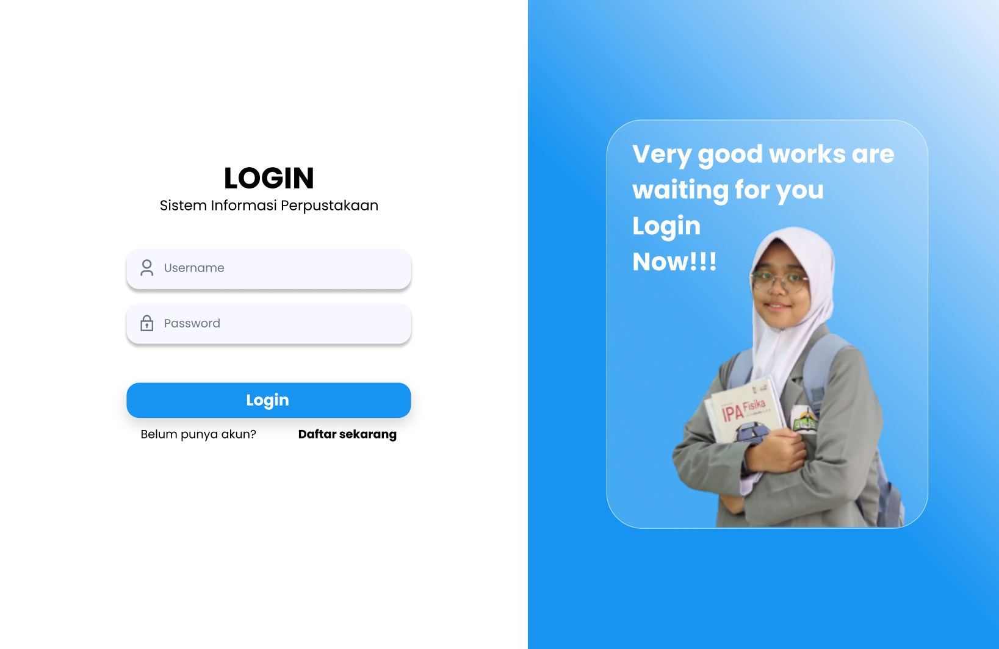
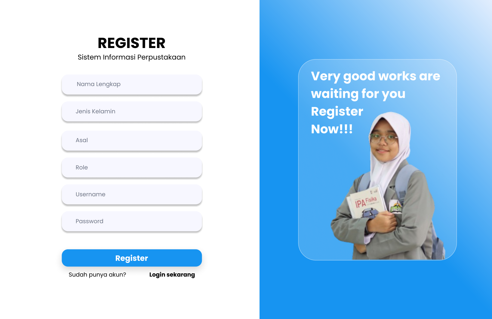

 

**BAB I Pendahuluan**
----------
1.1 Tujuan
----------
Dokumen Software Requirement Specification (SRS) merupakan dokumen spesifikasi perangkat lunak untuk membangun "Sistem Absensi Perpustakaan SMA AL-Ittihad Rumbai". Dokumen ini dibangun untuk memudahkan Perpustakaan SMA Al-Ittihad untuk menginput absen di perpustakaan sekolah tersebut. Sehingga dokumen ini dapat dijadikan acuan teknis untuk membangun "Sistem Absensi Perpustakaan SMA AL-Ittihad Rumbai Berbasis Website ".

1.2   Lingkup
----------
Sistem absensi perpustakaan SMA Al-Ittihad Rumbai merupakan aplikasi berbasis website yang kami bangun untuk mempermudah staf perpustakaan dalam mengelola absensi yang ada di perpustakaan tersebut, serta memudahkan staf dalam melihat laporan karena sudah terhubung ke dalam database.

1.3    Akronim, Singkatan, Definisi
----------
| Istilah | Definisi |
| ------ | ------ |
| SRS |Software Requirement Specification|
| Login | Digunakan untuk mengakses aplikasi |
| Software Requirement Specification | perangkat lunak yang akan dibuat dan sebagai penyembatani komunikasi pembuat dengan pengguna |
| Use Case | situasi dimana sistem anda digunakan untuk memenuhi satu atau lebih kebutuhan pemakaian anda |

1.4   Referensi
----------
Referensi yang digunakan dalam pengembangan perangkat lunak ini adalah :
- http://hasantarmizi.blogspot.co.id/2017/04/pengertian-sublime-text.html
- IEEE. IEEE Std 830-1998 IEEE Recommended Practice for Software  Requirements Specifications. IEEE Computer Society, 1998. 1.5  Overview 
- https://www.mysch.id/blog/detail/112/aplikasi-perpustakaan-digital
- https://www.talenta.co/blog/contoh-absensi-online-gratis-dengan-google-forms-hingga-mobile-app/

1.5   Overview
----------
Bab selanjutnya yaitu menjelaskan sistem yang di terapkan pada aplikasi. Menjelaskan gambaran umum dari aplikasi, sistem interface aplikasi dan alur sistemnya. Bab terakhir menjelaskan tentang setiap fungsi yang digunakan secara teknisnya. Pada bab 2 dan 3 merupakan deskripsi dari aplikasi yang akan diterapkan pada aplikasi yang dibuat.

**BAB II Gambaran Umum**
----------
Pada zaman era globalisasi perkembangan teknologi begitu sangat pesat, salah satunya ialah perkembangan teknologi di bidang software engineering dimana software engineering dapat digunakan dalam kehidupan sehari–hari. Seperti perpustakaan tidak bisa dipisahkan dari pembelajaran siswa dan siswi di SMA IT AL-Ittihad dalam mencari ilmu pengetahuan. Fasilitas yang disediakan perpustakaan sekolah ini, sangatlah bermanfaat bagi semua siswa dan siswi dalam studi kasus proyek kami ini menganalisis kebutuhan suatu sekolah di daerah Pekanbaru tepatnya di Rumbai Kecamatan Rumbai Pesisir. Kasus yang kami peroleh pembuatan laporan pengunjung di Perpustakaan Sekolah ini. Maka dari itu kami sebagai software engineering merancang sebuah sistem sesuai dengan kebutuhan Sekolah ini dengan menerapkan sistem absensi berbasis website yang akan menggantikan sistem manual sebelumnya. 

Dalam pembuatan sistem tersebut menggunakan pemrograman PHP dengan Sublime Text 3 dan menggunakan XAMPP untuk membuat databasenya. Penggunaan sistem absensi perpustakaan berbasis website ini diharapkan dapat mempermudah pustakawan dalam memperoleh data kehadiran siswa dan menginputkan data-data kunjungan siswa-siswi. Software yang kami buat ini berbasis website dimana website sebagai siswa-siswi (pengunjung) perpustakaan SMA IT AL-Ittihad Rumbai. Sistem yang kami buat di dalamnya terdapat data diri dan data kunjungan.

Berikut akan kami jelaskan sistem software kami, fungsi admin yaitu :
   - Mengelola data user
   - Mengelola data peminjaman
   - Mengelola data pengembalian
   - Mengelola data buku
   - Mengelola data kunjungan
   - Melihat dan mencetak laporan
   
   Berikut ini fungsi pengunjung :
   - Mengisi form kunjungan
   - Mengisi form peminjaman
   - Mengisi form pengembalian
   - Melihat data buku

2.1   Perspektif Produk
----------
Sistem absensi Perpustakaan SMA AL-Ittihad Rumbai berbasis website adalah sebuah sistem administrasi data yang diaplikasikan pada website. Terdapat 2 jenis, yaitu admin (staf perpustakaan) dan siswa-siswi (pengunjung). Siswa-siswi (pengunjung) dapat menginput data kunjungan dan admin (staf perpustakaan) dapat melihat data yang telah diinputkan oleh pengunjung.

**2.1.1 Antarmuka Sistem**

Sistem Absensi Perpustakaan SMA Al-Ittihad Rumbai berbasis website ini memiliki 2 user, yaitu siswa-siswi (pengunjung) dan admin (staf perpustakaan). Siswa-siswi (pengunjung) mempunyai fungsi yaitu menginput data kunjungan dan admin (staf perpustakaan) dapat melihat data yang telah diinputkan oleh pengunjung.

**2.1.2 Antarmuka Pengguna**

   - **Mockup Pengunjung ( Website )**

|  |  |
|--|--|
|  Pada halaman ini admin diminta untuk login.|  Pada halaman ini diminta untuk mengisi username  dan password.|
|  Pada halaman ini diminta untuk mengisi registrasi. |  Pada halaman ini diminta untuk mengisi nama anggota dan kelas  dan tanggal registrasi.|
|  Pada halaman ini diminta untuk mengisi tujuan datang ke perpustakaan. |  Pada halaman ini diminta untuk memberikan feedback. |
|  Pada halaman ini menampilkan akun data diri. |

   - **Mockup Admin ( Website )**

|  |  |
|--|--|
|  Pada halaman ini admin diminta untuk login.|  Pada halaman ini diminta untuk mengisi username  dan password.|
|  Pada halaman ini diminta untuk mengisi registrasi. |  Pada halaman ini merupakan tampilan home admin.|
|  Pada halaman ini merupakan tampilan siswa dan guru yang datang berkunjung. |  Pada halaman ini merupakan data kunjungan. |
 
**2.1.3 Antarmuka Perangkat Keras**

Antarmuka perangkat keras yang digunakan untuk mengoperasikan perangkat lunak sistem absensi perpustakaan SMA Al-Ittihad Rumbai antara lain :

1. PC / Laptop
Untuk menjalankan Aplikasi ini admin membutuhkan sebuah PC yang menggunakan OS Windows, Linux, atau MAC dan sudah terinstall browser .

**2.1.4 Operasi-Operasi**

| Operasi | Fungsi |
| ------ | ------ |
| Login | Digunakan untuk mengakses aplikasi |
| Input Data | Digunakan untuk memasukkan data-data |
| Kembali | Digunakan untuk kembali ke halaman sebelumnya |
| Hapus | Digunakan untuk menghapus data |
| Edit | Digunakan untuk mengubah data |
| View | Digunakan untuk menampilkan data |
| Simpan | Digunakan untuk menyimpan data |

2.2 Spesifikasi Kebutuhan Fungsional
----------

   
**2.2.1 Admin Registrasi**

Use Case: Registrasi

Diagram : 

Deskripsi Singkat:
Admin melakukan registrasi terlebih dahulu sebelum masuk ke tampilan login.
Deskripsi langkah-langkah:
1. Admin melakukan registrasi dengan mengisi form registrasi
2. Sistem melakukan validasi registrasi akun
3. Jika berhasil, sistem akan mengarahkan ke halaman login
4. Jika gagal, sistem akan menampilkan peringatan dan admin kembali diminta mengisi form registrasi
   
**2.2.2 Admin Login**

Use Case: Login

Diagram: 

Deskripsi Singkat:
Admin melakukan login menggunakan username dan password yang telah didaftarkan ketika registrasi.
Deskripsi Langkah-langkah:
1. Admin melakukan login dengan username dan password
2. Sistem melakukan validasi akun
3. Jika akun valid, maka sistem akan mengarahkan ke halaman dashboard
4. Jika akun tidak valid, maka admin diminta kembali menginputkan username dan password

**2.2.3 Admin Mengelola Data User**

Use Case: Mengelola Data User

Diagram :

Deskripsi Singkat:
Admin dapat mengelola data user, seperti tambah, edit, dan hapus.
Deskripsi Langkah-langkah:
1. Admin memilih data user
2. Sistem menampilkan seluruh data user
3. Admin mengelola data user dan mengklik tombol simpan
4. Sistem menyimpan hasil kelola data user
      
**2.2.4 Admin Mengelola Data Peminjaman**

Use Case: Mengelola data Peminjaman

Diagram:

      
Deskripsi Singkat
Admin dapat mengelola data peminjaman, seperti tambah, edit, dan hapus.
Deskripsi Langkah-langkah
1. Admin memilih menu peminjaman
2. Sistem menampilkan seluruh data peminjaman
3. Admin mengelola data peminjaman dan mengklik tombol simpan
4. Sistem menyimpan hasil kelola data peminjaman

**2.2.5 Admin Kelola Data Pengembalian**

Use Case: Mengelola Data Pengembalian

Diagram:

Deskripsi Singkat:
Admin dapat mengelola data pengembalian, seperti tambah, edit, dan hapus.
Deskripsi Langkah-langkah
1. Admin memilih menu pengembalian
2. Sistem menampilkan seluruh data pengembalian
3. Admin mengelola data pengembalian dan mengklik tombol simpan
4. Sistem menyimpan hasil kelola data pengembalian

**2.2.6 Admin Kelola Data Buku**

Use Case: Mengelola Data Buku

Diagram:

Deskripsi Singkat:
Admin dapat mengelola data buku, seperti tambah, edit, dan hapus.
Deskripsi Langkah-langkah
1. Admin memilih menu buku
2. Sistem menampilkan seluruh data buku
3. Admin mengelola data buku dan mengklik tombol simpan
4. Sistem menyimpan hasil kelola data buku

**2.2.7 Admin Kelola Data Kunjungan**

Use Case: Mengelola Data Kunjungan

Diagram:

Deskripsi Singkat:
Admin dapat mengelola data kunjungan, seperti tambah, edit, dan hapus.
Deskripsi Langkah-langkah
1. Admin memilih menu kunjungan
2. Sistem menampilkan seluruh data kunjungan
3. Admin mengelola data kunjungan dan mengklik tombol simpan
4. Sistem menyimpan hasil kelola data kunjungan

**2.2.8 Admin Melihat dan Mencetak Laporan**

Use Case: Melihat dan Mencetak Laporan

Diagram:

Deskripsi Singkat:
Admin dapat melihat laporan yang berisi data kunjungan, data peminjaman, data pengembalian, dan data user.
Deskripsi Langkah-langkah
1. Admin memilih menu laporan
2. Admin melakukan pencarian dengan memasukkan tanggal peminjaman, tanggal pengembalian atau nama user
3. Sistem menampilkan seluruh data yang diminta admin
4. Admin melihat data yang diminta
5. Jika admin ingin mencetak laporan, maka admin memilih cetak
6. Sistem akan mencetak laporan

**2.2.9 User Registrasi**

Use Case: Registrasi

Diagram:

Deskripsi Singkat:
User melakukan registrasi terlebih dahulu sebelum masuk ke tampilan login.
Deskripsi langkah-langkah:
1. User melakukan registrasi dengan mengisi form registrasi
2. Sistem melakukan validasi registrasi akun
3. Jika berhasil, sistem akan mengarahkan ke halaman login
4. Jika gagal, sistem akan menampilkan peringatan dan user kembali diminta mengisi form registrasi 

**2.2.10 User Login**

Use Case: Login

Diagram:

Deskripsi Singkat:
User melakukan login menggunakan username dan password yang telah didaftarkan ketika registrasi.
Deskripsi Langkah-langkah:
1. User melakukan login dengan username dan password
2. Sistem melakukan validasi akun
3. Jika akun valid, maka sistem akan mengarahkan ke halaman dashboard
4. Jika akun tidak valid, maka user diminta kembali menginputkan username dan password

**2.2.11 Pengunjung Mengisi Form Kunjungan**

Use Case: Mengisi Form Kunjungan

Diagram:

Deskripsi Singkat:
User mengisi form kunjungan ketika datang ke perpustakaan.
Deskripsi Langkah-langkah:
1. User memilih menu kunjungan
2. Sistem menampilkan riwayat kunjungan dan form kunjungan
3. User mengisi form kunjungan dan menyimpan form
4. Sistem akan menyimpan inputan ke database dan inputan akan tampil pada menu kunjungan admin

**2.2.12 Pengunjung Mengisi Form Peminjaman**

Use Case: Mengisi Form Peminjaman

Diagram:

Deskripsi Singkat:
User mengisi form peminjaman ketika ingin meminjam buku.
Deskripsi Langkah-langkah:
1. User memilih menu peminjaman
2. Sistem menampilkan riwayat peminjaman dan form peminjaman
3. User mengisi form peminjaman dan menyimpan form
4. Sistem akan menyimpan inputan ke database dan inputan akan tampil pada menu peminjaman admin

**2.2.13 Pengunjung Mengisi Form Pengembalian**

Use Case: Mengisi Form Pengembalian

Diagram:

Deskripsi Singkat:
User mengisi form pengembalian ketika ingin mengembalikan buku.
Deskripsi Langkah-langkah:
1. User memilih menu pengembalian
2. Sistem menampilkan riwayat pengembalian dan form peminjaman
3. User mengisi form pengembalian dan menyimpan form
4. Sistem akan menyimpan inputan ke database dan inputan akan tampil pada menu pengembalian admin

**2.2.14 User Melihat Data Buku**

Use Case: Melihat Data Buku

Diagram:

Deskripsi Singkat:
User dapat melihat data buku.
Deskripsi Langkah-langkah
1. User memilih menu buku
2. User melakukan pencarian dengan memasukkan judul buku, kategori buku, nama pengarang, nama penerbit atau lokasi buku
3. Sistem menampilkan seluruh data yang diminta user
4. User melihat data yang diminta

2.3   Spesifikasi Kebutuhan Non-Fungsional
----------
- Tabel Kebutuhan Non-Fungsional 

   | No | Deskripsi |
   | ------ | ------ |
   | 1 | Semua interface dan fungsi menggunakan Bahasa Indonesia |
   | 2 | Perangkat Lunak dapat dipakai di semua platofrm  OS ( Admin dan pengunjung ) 
 
2.4   Karakteristik Pengguna
----------
Karakteristik pengguna dari perangkat lunak ini adalah pengguna langsung berinteraksi dengan sistem tanpa harus dihubungkan dengan hak akses atau level autentikasi.

2.5   Batasan-Batasan
----------
- Perangkat lunak web hanya dijalankan di windows (10 dan 11). 
- Waktu pengembangan perangkat lunak yang singkat membuat adanya kemungkinan tidak semua fungsi yang ada dapat dilaksanakan.

BAB III Requirement Specification
----------
3.1 Persyaratan Antarmuka Eksternal
----------
Salah satu cara mengakses aplikasi ini yaitu dengan registrasi akun, kemudian admin maupun user login menggunakan username dan password yang telah didaftarkan ketika registrasi. Setelah berhasil login, user dapat mengisi form kunjungan, form peminjaman, form pengembalian atau melihat data buku, dan admin dapat mengelola data user, data peminjaman, data pengembalian, data buku, data kunjungan atau melihat dan mencetak laporan di sistem tersebut.
      
3.2 Functional Requirement
----------
Logika Struktur terdapat pada bagian 3.3.1
      
**3.2.1 Admin Registrasi**

|  |  |
|--|--|
| Nama Fungsi | Registrasi |
| Xref | Bagian 2.2.1, Admin Registrasi |
| Trigger | Membuka website sistem informasi perpustakaan |
| Precondition | Halaman registrasi |
| Basic Path | 1. Admin melakukan registrasi dengan mengisi form registrasi   2. Sistem melakukan validasi registrasi akun   3. Jika berhasil, sistem akan mengarahkan ke halaman login   4. Jika gagal, sistem akan menampilkan peringatan dan admin kembali diminta mengisi form registrasi |
| Alternative | Tidak ada |
| Post Condition | Admin berhasil validasi akun dan dapat melakukan login |
| Exception Push | Validasi akun gagal |
      
**3.2.2 Admin Login**

|  |  |
|--|--|
| Nama Fungsi | Login |
| Xref | Bagian 2.2.2, Admin Login |
| Trigger | Membuka website sistem informasi perpustakaan |
| Precondition | Halaman login |
| Basic Path | 1. Admin melakukan login dengan username dan password   2. Sistem melakukan validasi akun   3. Jika akun valid, maka sistem akan mengarahkan ke halaman dashboard   4. Jika akun tidak valid, maka admin diminta kembali menginputkan username dan password |
| Alternative | Tidak ada |
| Post Condition | Admin berhasil login dan mengakses website |
| Exception Push | Username dan password salah |
   
**3.2.3 Admin Mengelola Data User**

|  |  |
|--|--|
| Nama Fungsi | Mengelola Data User |
| Xref | Bagian 2.2.3, Admin Mengelola Data User |
| Trigger | Membuka website sistem informasi perpustakaan |
| Precondition | Halaman dashboard admin |
| Basic Path | 1. Admin memilih data user   2. Sistem menampilkan seluruh data user   3. Admin mengelola data user dan mengklik tombol simpan   4. Sistem menyimpan hasil kelola data user |
| Alternative | Tidak ada |
| Post Condition | Admin berhasil mengelola data user |
| Exception Push | Tidak ada koneksi |

**3.2.4 Admin Mengelola Data Peminjaman**

|  |  |
|--|--|
| Nama Fungsi | Mengelola Data Peminjaman |
| Xref | Bagian 2.2.4, Admin Mengelola Data Peminjaman |
| Trigger | Membuka website sistem informasi perpustakaan |
| Precondition | Halaman dashboard admin |
| Basic Path | 1. Admin memilih menu peminjaman   2. Sistem menampilkan seluruh data peminjaman   3. Admin mengelola data peminjaman dan mengklik tombol simpan   4. Sistem menyimpan hasil kelola data peminjaman |
| Alternative | Tidak ada |
| Post Condition | Admin berhasil mengelola data peminjaman |
| Exception Push | Tidak ada koneksi |

**3.2.5 Admin Mengelola Data Pengembalian**

|  |  |
|--|--|
| Nama Fungsi | Mengelola Data Pengembalian |
| Xref | Bagian 2.2.5, Admin Mengelola Data Pengembalian |
| Trigger | Membuka website sistem informasi perpustakaan |
| Precondition | Halaman dashboard admin |
| Basic Path | 1. Admin memilih menu pengembalian   2. Sistem menampilkan seluruh data pengembalian   3. Admin mengelola data pengembalian dan mengklik tombol simpan   4. Sistem menyimpan hasil kelola data pengembalian |
| Alternative | Tidak ada |
| Post Condition | Admin berhasil mengelola data pengembalian |
| Exception Push | Tidak ada koneksi |

**3.2.6 Admin Mengelola Data Buku**

|  |  |
|--|--|
| Nama Fungsi | Mengelola Data Buku |
| Xref | Bagian 2.2.6, Admin Mengelola Data Buku |
| Trigger | Membuka website sistem informasi perpustakaan |
| Precondition | Halaman dashboard admin |
| Basic Path | 1. Admin memilih menu buku   2. Sistem menampilkan seluruh data buku   3. Admin mengelola data buku dan mengklik tombol simpan   4. Sistem menyimpan hasil kelola data buku |
| Alternative | Tidak ada |
| Post Condition | Admin berhasil mengelola data buku |
| Exception Push | Tidak ada koneksi |

**3.2.7 Admin Mengelola Data Kunjungan**

|  |  |
|--|--|
| Nama Fungsi | Mengelola Data Kunjungan |
| Xref | Bagian 2.2.7, Admin Mengelola Data Kunjungan |
| Trigger | Membuka website sistem informasi perpustakaan |
| Precondition | Halaman dashboard admin |
| Basic Path | 1. Admin memilih menu kunjungan   2. Sistem menampilkan seluruh data kunjungan   3. Admin mengelola data kunjungan dan mengklik tombol simpan   4. Sistem menyimpan hasil kelola data kunjungan |
| Alternative | Tidak ada |
| Post Condition | Admin berhasil mengelola data kunjungan |
| Exception Push | Tidak ada koneksi |
   
**3.2.8 Admin Melihat dan Mencetak Laporan**

|  |  |
|--|--|
| Nama Fungsi | Melihat dan Mencetak Laporan |
| Xref | Bagian 2.2.8, Admin Lihat Data Absen |
| Trigger | Membuka website sistem absensi perpustakaan |
| Precondition | Halaman dashboard admin |
| Basic Path | 1.  Admin memilih menu laporan   2. Admin melakukan pencarian dengan memasukkan tanggal peminjaman, tanggal pengembalian atau nama user   3. Sistem menampilkan seluruh data yang diminta admin   4. Admin melihat data yang diminta   5. Jika admin ingin mencetak laporan, maka admin memilih cetak   6. Sistem akan mencetak laporan |
| Alternative | Tidak ada |
| Post Condition | Admin dapat melihat dan mencetak laporan |
| Exception Push | Tidak ada koneksi |
   
**3.2.9 User Registrasi**

|  |  |
|--|--|
| Nama Fungsi | Registrasi |
| Xref | Bagian 2.2.9, User Registrasi |
| Trigger | Membuka website sistem informasi perpustakaan |
| Precondition | Halaman registrasi |
| Basic Path | 1. User melakukan registrasi dengan mengisi form registrasi   2. Sistem melakukan validasi registrasi akun   3. Jika berhasil, sistem akan mengarahkan ke halaman login   4. Jika gagal, sistem akan menampilkan peringatan dan user kembali diminta mengisi form registrasi |
| Alternative | Tidak ada |
| Post Condition | User berhasil validasi akun dan dapat melakukan login |
| Exception Push | Validasi akun gagal |

**3.2.10 User Login**

|  |  |
|--|--|
| Nama Fungsi | Login |
| Xref | Bagian 2.2.10, User Login |
| Trigger | Membuka website sistem informasi perpustakaan |
| Precondition | Halaman login |
| Basic Path | 1. User melakukan login dengan username dan password   2. Sistem melakukan validasi akun   3. Jika akun valid, maka sistem akan mengarahkan ke halaman dashboard   4. Jika akun tidak valid, maka user diminta kembali menginputkan username dan password |
| Alternative | Tidak ada |
| Post Condition | user berhasil login dan mengakses website |
| Exception Push | Username dan password salah |

**3.2.11 User Mengisi Form Kunjungan**

|  |  |
|--|--|
| Nama Fungsi | Mengisi Form Kunjungan |
| Xref | Bagian 2.2.11, User Mengisi Form Kunjungan |
| Trigger | Membuka website sistem informasi perpustakaan |
| Precondition | Halaman dahboard pengunjung |
| Basic Path | 1. User memilih menu kunjungan   2. Sistem menampilkan riwayat kunjungan dan form kunjungan   3. User mengisi form kunjungan dan menyimpan form   4. Sistem akan menyimpan inputan ke database dan inputan akan tampil pada menu kunjungan admin |
| Alternative | Tidak ada |
| Post Condition | Pengunjung berhasil mengisi data kunjungan |
| Exception Push | Tidak ada koneksi |

**3.2.12 User Mengisi Form Peminjaman**

|  |  |
|--|--|
| Nama Fungsi | Mengisi Form Peminjaman |
| Xref | Bagian 2.2.12, User Mengisi Form Peminjaman |
| Trigger | Membuka website sistem informasi perpustakaan |
| Precondition | Halaman dahboard pengunjung |
| Basic Path | 1. User memilih menu peminjaman   2. Sistem menampilkan riwayat peminjaman dan form peminjaman   3. User mengisi form peminjaman dan menyimpan form   4. Sistem akan menyimpan inputan ke database dan inputan akan tampil pada menu peminjaman admin |
| Alternative | Tidak ada |
| Post Condition | User berhasil mengisi data peminjaman |
| Exception Push | Tidak ada koneksi |

**3.2.13 User Mengisi Form Pengembalian**

|  |  |
|--|--|
| Nama Fungsi | Mengisi Form Pengembalian |
| Xref | Bagian 2.2.13, User Mengisi Form Pengembalian |
| Trigger | Membuka website sistem informasi perpustakaan |
| Precondition | Halaman dahboard pengunjung |
| Basic Path | 1. User memilih menu pengembalian   2. Sistem menampilkan riwayat pengembalian dan form pengembalian   3. User mengisi form pengembalian dan menyimpan form   4. Sistem akan menyimpan inputan ke database dan inputan akan tampil pada menu pengembalian admin |
| Alternative | Tidak ada |
| Post Condition | User berhasil mengisi data pengembalian |
| Exception Push | Tidak ada koneksi |

**3.2.14 User Melihat Data Buku**

|  |  |
|--|--|
| Nama Fungsi | Melihat Data Buku |
| Xref | Bagian 2.2.14, User Melihat Data Buku |
| Trigger | Membuka website sistem informasi perpustakaan |
| Precondition | Halaman dahboard pengunjung |
| Basic Path | 1. User memilih menu buku   2. User melakukan pencarian dengan memasukkan judul buku, kategori buku, nama pengarang, nama penerbit atau lokasi buku   3. 3. Sistem menampilkan seluruh data yang diminta user   4. User melihat data yang diminta |
| Alternative | Tidak ada |
| Post Condition | User berhasil melihat data buku |
| Exception Push | Tidak ada koneksi |
   
3.3 Struktur Detail Kebutuhan Non-Fungsional
----------
**3.3.1 Logika Struktur Data**
Struktur data logika pada sistem absensi perpustakaan terdapat struktur database yang dijelaskan menggunakan ERD.

**Tabel Siswa**

| Data Item | Type | Deskripsi |
| ------ | ------ | ------ |
| id_admin| varchar | Nomor auto increment id_admin |
| username | varchar | Berisikan NIP untuk akses login admin |
| password | varchar | Berisikan password untuk login admin |
| role | varchar | Untuk membedakan role saat login |
| nama | varchar | Berisikan nama admin |
| jenis_kelamin | varchar | Berisikan jenis kelamin admin |

**Tabel Pengunjung**

| Data Item | Type | Deskripsi |
| ------ | ------ | ------ |
| id_pengunjung| varchar | Nomor auto increment id_pengunjung |
| username | varchar | Berisikan NIP untuk akses login pengunjung |
| password | varchar | Berisikan password untuk login pengunjung |
| role | varchar | Untuk membedakan role saat login |
| nama | varchar | Berisikan nama pengunjung |
| asal | varchar | Berisikan asal pengunjung |
| jenis_kelamin | varchar | Berisikan jenis kelamin pengunjung |

**Tabel Absen**

| Data Item | Type | Deskripsi |
| ------ | ------ | ------ |
| id_absen| varchar | Nomor auto increment id_absen |
| username | varchar | Berisikan NISN/NIP untuk mengisi absen kunjungan |
| tanggal_waktu | datetime | Berisikan tanggal dan waktu kunjungan |
| tujuan | varchar | Berisikan tujuan kunjungan |
| kesan_pesan | varchar | Berisikan kesan dan pesan |

Dokumentasi dan Validasi Wawancara
----------

Jobdesk
----------

| Nama | Jobdesk |
| ------ | ------ |
| Rina Al-Qomar Puji Siswati | Membuat srs dan prototype |
| Said Fahrur Raziq | Membuat use case dan srs |
| Shasy Wiade Putri | Membuat srs, erd, dan prototype |
